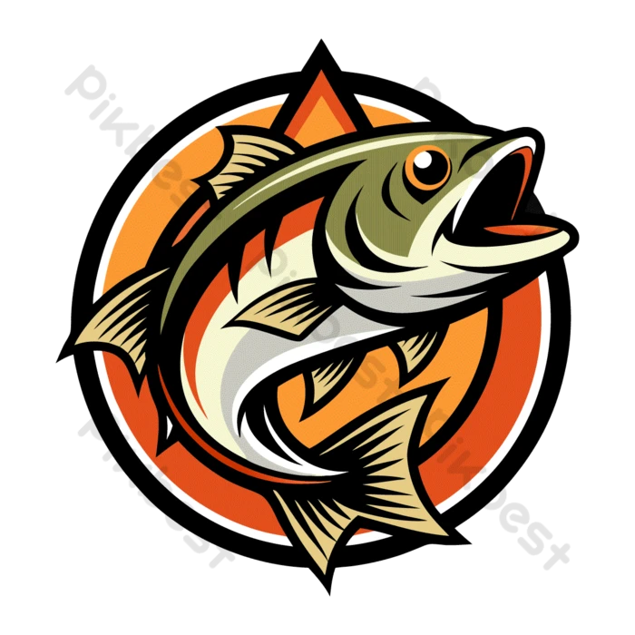
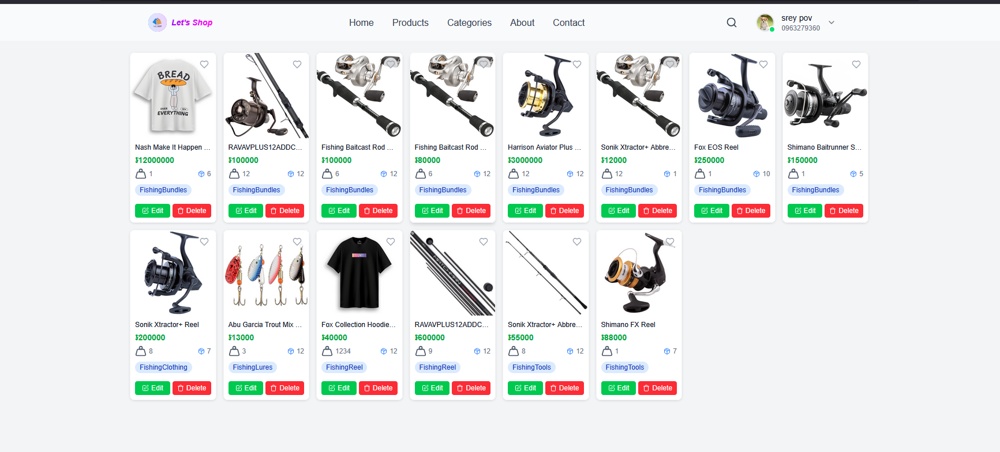
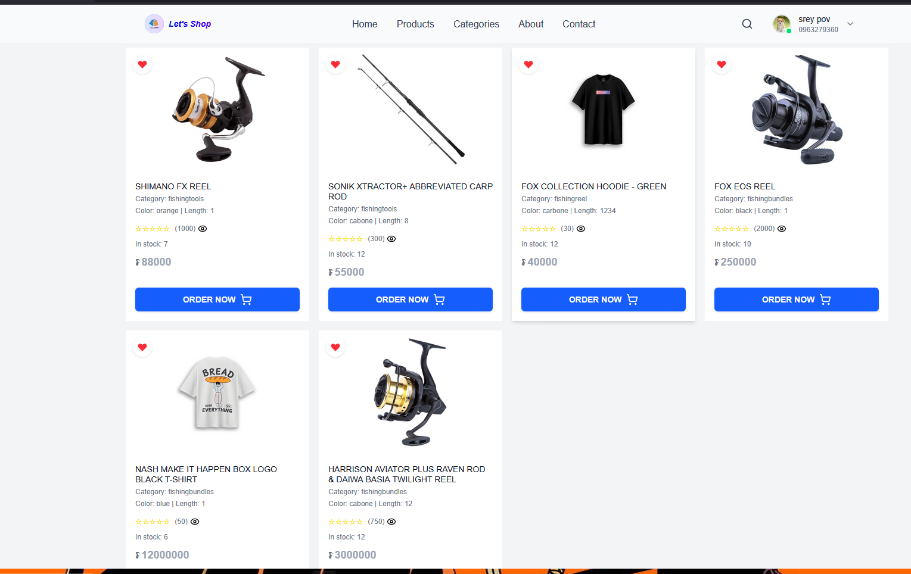

# 🎣 Fishing Store - Vue.js E-Commerce Application

  
  
  
  
  
  

## 📖 About

A modern, responsive e-commerce application built with Vue.js and php for back end, specifically designed for fishing equipment and gear. Features a complete shopping experience with user authentication, product categories, favorites system, and order management.

## ✨ Features

- 🔐 **User Authentication** - Secure login and registration system
- 🛍️ **Product Catalog** - Browse fishing equipment by categories
- ❤️ **Favorites System** - Save and manage favorite products
- 📏 **Size Guide** - Interactive size guide modal for products
- 🛒 **Order Management** - Complete ordering and receipt system
- 📱 **Responsive Design** - Mobile-first approach with Tailwind CSS
- 🎨 **Modern UI** - Clean and intuitive user interface

## 🖼️ Screenshots

  
  
<em>Main application interface</em>

  
  
  
<em>Product addition interface</em>

## 🚀 Quick Start

### Prerequisites

- Node.js (v22.12.0)
- npm or yarn package manager

### Installation

1. **Clone the repository**
   \`\`\`bash
   git clone <repository-url>
   cd fishing-store
   \`\`\`

2. **Install dependencies**
   \`\`\`bash
   npm install

   # or

   yarn install
   \`\`\`

3. **Start development server**
   \`\`\`bash
   npm run dev

   # or

   yarn dev
   \`\`\`

4. **Open your browser**
   \`\`\`
   http://localhost:5173
   \`\`\`

### Build for Production

\`\`\`bash
npm run build

# or

yarn build
\`\`\`

## 📁 Project Structure

\`\`\`
fishing-store/
├── 📄 README.md
├── 📄 index.html
├── 📦 package.json
├── ⚙️ vite.config.js
├── ⚙️ tailwind.config.js
├── 📁 public/
│ ├── 🖼️ fishingLogo.png
│ └── 🖼️ vite.svg
└── 📁 src/
├── 📄 App.vue
├── 📄 main.js
├── 🎨 style.css
├── 📁 assets/
│ ├── 🖼️ vue.svg
│ ├── 🖼️ preview.png
│ └── 🖼️ preview_add.png
├── 📁 components/
│ ├── 🧩 navbar.vue
│ ├── 🧩 footer.vue
│ └── 🧩 modal_form.vue
├── 📁 router/
│ └── 📄 index.js
├── 📁 stores/
│ └── 📄 auth.js
└── 📁 views/
├── 🏠 homePage.vue
├── 🛒 card.vue
├── 📋 order_product.vue
├── 🧾 customer_receipt.vue
├── 📏 Size_Guide_Modal.vue
├── 🔧 modal.vue
├── 📁 categories/
│ ├── ❤️ add_favorite.vue
│ ├── 📋 cate_demo.vue
│ └── 📄 cate_detail.vue
└── 📁 mod/
├── 🔐 AuthModal.vue
├── 🔐 AuthView.vue
├── ❤️ FavoriteButton.vue
└── 👤 Registration_user.vue
\`\`\`

## 🛠️ Tech Stack

| Technology       | Purpose                 | Version |
| ---------------- | ----------------------- | ------- |
| **Vue.js**       | Frontend Framework      | 3.x     |
| **Vite**         | Build Tool & Dev Server | Latest  |
| **Vue Router**   | Client-side Routing     | 4.x     |
| **Pinia**        | State Management        | Latest  |
| **Tailwind CSS** | Utility-first CSS       | 3.x     |
| **JavaScript**   | Programming Language    | ES6+    |

## 🎯 Key Components

### 🔐 Authentication System

- **AuthModal.vue** - Login/Register modal
- **AuthView.vue** - Authentication page view
- **Registration_user.vue** - User registration form

### 🛍️ Product Management

- **card.vue** - Product card component
- **cate_demo.vue** - Category demonstration
- **cate_detail.vue** - Category detail view
- **Size_Guide_Modal.vue** - Interactive size guide

### ❤️ Favorites System

- **add_favorite.vue** - Add to favorites functionality
- **FavoriteButton.vue** - Favorite toggle button

### 🛒 Order System

- **order_product.vue** - Product ordering interface
- **customer_receipt.vue** - Order confirmation and receipt

## 🚀 Available Scripts

| Command           | Description              |
| ----------------- | ------------------------ |
| `npm run dev`     | Start development server |
| `npm run build`   | Build for production     |
| `npm run preview` | Preview production build |
| `npm run lint`    | Run ESLint               |

## 🤝 Contributing

1. Fork the repository
2. Create your feature branch (`git checkout -b feature/AmazingFeature`)
3. Commit your changes (`git commit -m 'Add some AmazingFeature'`)
4. Push to the branch (`git push origin feature/AmazingFeature`)
5. Open a Pull Request

## 📝 License

This project is licensed under the MIT License - see the [LICENSE](LICENSE) file for details.

## 👥 Authors

- **Your Name** - _Initial work_ - [YourGitHub](https://github.com/yourusername)

## 🙏 Acknowledgments

- Vue.js community for the amazing framework
- Tailwind CSS for the utility-first approach
- All contributors who helped shape this project

---

  
Made with ❤️ for the fishing community

  
⭐ Star this repo if you found it helpful!

